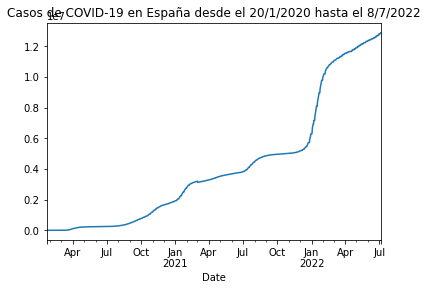
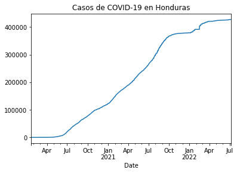

# AD4: Uso la API del COVID-19 con Pandas

Para comenzar, definiremos una API. Las siglas provienen del inglés *application programming interface* o interfaz de programación de aplicaciones la que permite el intercambio de información entre dos componentes de software independientes.

Para continuar con el ejercicio, me conecto a la API https://api.covid19api.com/ que usaremos para esta actividad.

## Instalación de Pandas

Para cargar los datos del a API, así como para trabajar con ellos como un dataframe, se utiliza la librería Pandas, la cual instala a continuación.


```python
!pip install pandas
```

    Requirement already satisfied: pandas in c:\users\evole\anaconda3\lib\site-packages (1.4.2)
    Requirement already satisfied: numpy>=1.18.5 in c:\users\evole\anaconda3\lib\site-packages (from pandas) (1.21.5)
    Requirement already satisfied: python-dateutil>=2.8.1 in c:\users\evole\anaconda3\lib\site-packages (from pandas) (2.8.2)
    Requirement already satisfied: pytz>=2020.1 in c:\users\evole\anaconda3\lib\site-packages (from pandas) (2021.3)
    Requirement already satisfied: six>=1.5 in c:\users\evole\anaconda3\lib\site-packages (from python-dateutil>=2.8.1->pandas) (1.16.0)
    

## Configuración de Pandas

Lo siguente, tras la instalación de la librería Pandas, es importarla, operación que realizó abajo.


```python
import pandas as pd 
```

# Variables

Se utiliza la variable `url`, que contiene la lista de los países.


```python
url = 'https://api.covid19api.com/countries'
```

Para comprobar que funciono, invoco a `url` y verifico que me sale muestra el valor de la entidad.


```python
url
```


    'https://api.covid19api.com/countries'


## Creación de *Dataframe*

Luego de la comprobación del funcionamiento de la `url`, utilizo la función de Pandas `read_json()`, la cual es capaz de leer el `JSON` que ofrece la API.


```python
df = pd.read_json(url)
```

Tras esto, invoco el *Dataframe* para comprobar que se raelizo la importanción. El éxito de la operación muestra a una tabla con 248 filas y tres columnas.


```python
df
```


<div>
<style scoped>
    .dataframe tbody tr th:only-of-type {
        vertical-align: middle;
    }

    .dataframe tbody tr th {
        vertical-align: top;
    }

    .dataframe thead th {
        text-align: right;
    }
</style>
<table border="1" class="dataframe">
  <thead>
    <tr style="text-align: right;">
      <th></th>
      <th>Country</th>
      <th>Slug</th>
      <th>ISO2</th>
    </tr>
  </thead>
  <tbody>
    <tr>
      <th>0</th>
      <td>Gibraltar</td>
      <td>gibraltar</td>
      <td>GI</td>
    </tr>
    <tr>
      <th>1</th>
      <td>Oman</td>
      <td>oman</td>
      <td>OM</td>
    </tr>
    <tr>
      <th>2</th>
      <td>France</td>
      <td>france</td>
      <td>FR</td>
    </tr>
    <tr>
      <th>3</th>
      <td>Jersey</td>
      <td>jersey</td>
      <td>JE</td>
    </tr>
    <tr>
      <th>4</th>
      <td>Mali</td>
      <td>mali</td>
      <td>ML</td>
    </tr>
    <tr>
      <th>...</th>
      <td>...</td>
      <td>...</td>
      <td>...</td>
    </tr>
    <tr>
      <th>243</th>
      <td>Puerto Rico</td>
      <td>puerto-rico</td>
      <td>PR</td>
    </tr>
    <tr>
      <th>244</th>
      <td>Papua New Guinea</td>
      <td>papua-new-guinea</td>
      <td>PG</td>
    </tr>
    <tr>
      <th>245</th>
      <td>Saint Pierre and Miquelon</td>
      <td>saint-pierre-and-miquelon</td>
      <td>PM</td>
    </tr>
    <tr>
      <th>246</th>
      <td>Timor-Leste</td>
      <td>timor-leste</td>
      <td>TL</td>
    </tr>
    <tr>
      <th>247</th>
      <td>Montenegro</td>
      <td>montenegro</td>
      <td>ME</td>
    </tr>
  </tbody>
</table>
<p>248 rows × 3 columns</p>
</div>


El código de arriba nos mostró los primeros y últimos cinco elementos de las filas. Por tratarse de `JSON`, el conteo se inicia con el 0 que ocupa la posición primera; se agrega una columna de control de la librería.

Ahora quiero sacar específicamente los datos de España. Como los nombres de los Estados están en inglés, España está escrito como *Spain*. Como hay una columna llamada *country* creo una lista nueva para que solo se muestra los datos de España.


```python
df[df['Country'] == 'Spain']
```


<div>
<style scoped>
    .dataframe tbody tr th:only-of-type {
        vertical-align: middle;
    }

    .dataframe tbody tr th {
        vertical-align: top;
    }

    .dataframe thead th {
        text-align: right;
    }
</style>
<table border="1" class="dataframe">
  <thead>
    <tr style="text-align: right;">
      <th></th>
      <th>Country</th>
      <th>Slug</th>
      <th>ISO2</th>
    </tr>
  </thead>
  <tbody>
    <tr>
      <th>141</th>
      <td>Spain</td>
      <td>spain</td>
      <td>ES</td>
    </tr>
  </tbody>
</table>
</div>


Me sale que el ID de *Spain*, en la columna de control de Pandas, es 201.

Ahora creo una nueva `URL`, de la misma API, para sacar solo los datos que corresponden a España, pero en tiempo real; esto se hizo en la primera linea.

En la segunda linea coloco un *Dataframe* que leerá los datos de la `URL` que especifiqué. 

Ya en la tercera línea, invocaré el *Dataframe* para comprobarlo.


```python
url_rt_es = 'https://api.covid19api.com/country/spain/status/confirmed/live'
df_rt_es = pd.read_json(url_rt_es)
df_rt_es
```


<div>
<style scoped>
    .dataframe tbody tr th:only-of-type {
        vertical-align: middle;
    }

    .dataframe tbody tr th {
        vertical-align: top;
    }

    .dataframe thead th {
        text-align: right;
    }
</style>
<table border="1" class="dataframe">
  <thead>
    <tr style="text-align: right;">
      <th></th>
      <th>Country</th>
      <th>CountryCode</th>
      <th>Province</th>
      <th>City</th>
      <th>CityCode</th>
      <th>Lat</th>
      <th>Lon</th>
      <th>Cases</th>
      <th>Status</th>
      <th>Date</th>
    </tr>
  </thead>
  <tbody>
    <tr>
      <th>0</th>
      <td>Spain</td>
      <td>ES</td>
      <td></td>
      <td></td>
      <td></td>
      <td>40.46</td>
      <td>-3.75</td>
      <td>0</td>
      <td>confirmed</td>
      <td>2020-01-22 00:00:00+00:00</td>
    </tr>
    <tr>
      <th>1</th>
      <td>Spain</td>
      <td>ES</td>
      <td></td>
      <td></td>
      <td></td>
      <td>40.46</td>
      <td>-3.75</td>
      <td>0</td>
      <td>confirmed</td>
      <td>2020-01-23 00:00:00+00:00</td>
    </tr>
    <tr>
      <th>2</th>
      <td>Spain</td>
      <td>ES</td>
      <td></td>
      <td></td>
      <td></td>
      <td>40.46</td>
      <td>-3.75</td>
      <td>0</td>
      <td>confirmed</td>
      <td>2020-01-24 00:00:00+00:00</td>
    </tr>
    <tr>
      <th>3</th>
      <td>Spain</td>
      <td>ES</td>
      <td></td>
      <td></td>
      <td></td>
      <td>40.46</td>
      <td>-3.75</td>
      <td>0</td>
      <td>confirmed</td>
      <td>2020-01-25 00:00:00+00:00</td>
    </tr>
    <tr>
      <th>4</th>
      <td>Spain</td>
      <td>ES</td>
      <td></td>
      <td></td>
      <td></td>
      <td>40.46</td>
      <td>-3.75</td>
      <td>0</td>
      <td>confirmed</td>
      <td>2020-01-26 00:00:00+00:00</td>
    </tr>
    <tr>
      <th>...</th>
      <td>...</td>
      <td>...</td>
      <td>...</td>
      <td>...</td>
      <td>...</td>
      <td>...</td>
      <td>...</td>
      <td>...</td>
      <td>...</td>
      <td>...</td>
    </tr>
    <tr>
      <th>893</th>
      <td>Spain</td>
      <td>ES</td>
      <td></td>
      <td></td>
      <td></td>
      <td>40.46</td>
      <td>-3.75</td>
      <td>12818184</td>
      <td>confirmed</td>
      <td>2022-07-03 00:00:00+00:00</td>
    </tr>
    <tr>
      <th>894</th>
      <td>Spain</td>
      <td>ES</td>
      <td></td>
      <td></td>
      <td></td>
      <td>40.46</td>
      <td>-3.75</td>
      <td>12818184</td>
      <td>confirmed</td>
      <td>2022-07-04 00:00:00+00:00</td>
    </tr>
    <tr>
      <th>895</th>
      <td>Spain</td>
      <td>ES</td>
      <td></td>
      <td></td>
      <td></td>
      <td>40.46</td>
      <td>-3.75</td>
      <td>12890002</td>
      <td>confirmed</td>
      <td>2022-07-05 00:00:00+00:00</td>
    </tr>
    <tr>
      <th>896</th>
      <td>Spain</td>
      <td>ES</td>
      <td></td>
      <td></td>
      <td></td>
      <td>40.46</td>
      <td>-3.75</td>
      <td>12890002</td>
      <td>confirmed</td>
      <td>2022-07-06 00:00:00+00:00</td>
    </tr>
    <tr>
      <th>897</th>
      <td>Spain</td>
      <td>ES</td>
      <td></td>
      <td></td>
      <td></td>
      <td>40.46</td>
      <td>-3.75</td>
      <td>12890002</td>
      <td>confirmed</td>
      <td>2022-07-07 00:00:00+00:00</td>
    </tr>
  </tbody>
</table>
<p>898 rows × 10 columns</p>
</div>


El código de arriba nos mostró los primeros y últimos cinco elementos de las filas que se corresponden para España. Al igual que anterior, por tratarse de JSON, el conteo se inicia con el 0 que ocupa la posición primera; se agrega una columna de control de la librería.

### Cabecera y cola

Para acceder a la cabecera se usa la función `head()`, pero con el *DataFrame* `df_rt_es.head()`.


```python
df_rt_es.head()
```


<div>
<style scoped>
    .dataframe tbody tr th:only-of-type {
        vertical-align: middle;
    }

    .dataframe tbody tr th {
        vertical-align: top;
    }

    .dataframe thead th {
        text-align: right;
    }
</style>
<table border="1" class="dataframe">
  <thead>
    <tr style="text-align: right;">
      <th></th>
      <th>Country</th>
      <th>CountryCode</th>
      <th>Province</th>
      <th>City</th>
      <th>CityCode</th>
      <th>Lat</th>
      <th>Lon</th>
      <th>Cases</th>
      <th>Status</th>
      <th>Date</th>
    </tr>
  </thead>
  <tbody>
    <tr>
      <th>0</th>
      <td>Spain</td>
      <td>ES</td>
      <td></td>
      <td></td>
      <td></td>
      <td>40.46</td>
      <td>-3.75</td>
      <td>0</td>
      <td>confirmed</td>
      <td>2020-01-22 00:00:00+00:00</td>
    </tr>
    <tr>
      <th>1</th>
      <td>Spain</td>
      <td>ES</td>
      <td></td>
      <td></td>
      <td></td>
      <td>40.46</td>
      <td>-3.75</td>
      <td>0</td>
      <td>confirmed</td>
      <td>2020-01-23 00:00:00+00:00</td>
    </tr>
    <tr>
      <th>2</th>
      <td>Spain</td>
      <td>ES</td>
      <td></td>
      <td></td>
      <td></td>
      <td>40.46</td>
      <td>-3.75</td>
      <td>0</td>
      <td>confirmed</td>
      <td>2020-01-24 00:00:00+00:00</td>
    </tr>
    <tr>
      <th>3</th>
      <td>Spain</td>
      <td>ES</td>
      <td></td>
      <td></td>
      <td></td>
      <td>40.46</td>
      <td>-3.75</td>
      <td>0</td>
      <td>confirmed</td>
      <td>2020-01-25 00:00:00+00:00</td>
    </tr>
    <tr>
      <th>4</th>
      <td>Spain</td>
      <td>ES</td>
      <td></td>
      <td></td>
      <td></td>
      <td>40.46</td>
      <td>-3.75</td>
      <td>0</td>
      <td>confirmed</td>
      <td>2020-01-26 00:00:00+00:00</td>
    </tr>
  </tbody>
</table>
</div>


Para que me muestre solo los datos del inicio usaré el DataFrame `df_rt_es.tail()`.


```python
df_rt_es.tail()
```


<div>
<style scoped>
    .dataframe tbody tr th:only-of-type {
        vertical-align: middle;
    }

    .dataframe tbody tr th {
        vertical-align: top;
    }

    .dataframe thead th {
        text-align: right;
    }
</style>
<table border="1" class="dataframe">
  <thead>
    <tr style="text-align: right;">
      <th></th>
      <th>Country</th>
      <th>CountryCode</th>
      <th>Province</th>
      <th>City</th>
      <th>CityCode</th>
      <th>Lat</th>
      <th>Lon</th>
      <th>Cases</th>
      <th>Status</th>
      <th>Date</th>
    </tr>
  </thead>
  <tbody>
    <tr>
      <th>893</th>
      <td>Spain</td>
      <td>ES</td>
      <td></td>
      <td></td>
      <td></td>
      <td>40.46</td>
      <td>-3.75</td>
      <td>12818184</td>
      <td>confirmed</td>
      <td>2022-07-03 00:00:00+00:00</td>
    </tr>
    <tr>
      <th>894</th>
      <td>Spain</td>
      <td>ES</td>
      <td></td>
      <td></td>
      <td></td>
      <td>40.46</td>
      <td>-3.75</td>
      <td>12818184</td>
      <td>confirmed</td>
      <td>2022-07-04 00:00:00+00:00</td>
    </tr>
    <tr>
      <th>895</th>
      <td>Spain</td>
      <td>ES</td>
      <td></td>
      <td></td>
      <td></td>
      <td>40.46</td>
      <td>-3.75</td>
      <td>12890002</td>
      <td>confirmed</td>
      <td>2022-07-05 00:00:00+00:00</td>
    </tr>
    <tr>
      <th>896</th>
      <td>Spain</td>
      <td>ES</td>
      <td></td>
      <td></td>
      <td></td>
      <td>40.46</td>
      <td>-3.75</td>
      <td>12890002</td>
      <td>confirmed</td>
      <td>2022-07-06 00:00:00+00:00</td>
    </tr>
    <tr>
      <th>897</th>
      <td>Spain</td>
      <td>ES</td>
      <td></td>
      <td></td>
      <td></td>
      <td>40.46</td>
      <td>-3.75</td>
      <td>12890002</td>
      <td>confirmed</td>
      <td>2022-07-07 00:00:00+00:00</td>
    </tr>
  </tbody>
</table>
</div>


### Creo un gráfico

Ahora realizaré un gráfico con la cantidad de casos y la fecha. Para ello convertiré la columna de control de España. Transformo la columna de fecha con la de control, pidiéndole que me muestra los casos del país desde el 20 de enero de 2020 al 29 de junio de 2022.

Para todo esto usaré la expresión `df_rt_es.set_index('Date')['Cases'].plot(title="Casos de COVID-19 en España desde el 20/01/2020 hasta el 29/06/2022")`. Para evitar inconvenientes con Anaconda3, a la variable le pondré el nombre de `plot_rt_es`.


```python
df_rt_es.set_index('Date') ['Cases'].plot(title="Casos de COVID-19 en España desde el 20/1/2020 hasta el 8/7/2022")
```


    <AxesSubplot:title={'center':'Casos de COVID-19 en España desde el 20/1/2020 hasta el 8/7/2022'}, xlabel='Date'>


    

    


## Repetir el proceso con Panamá

Debido a que tengo una columna de países, creo una lista nueva que seleccione solo los identificadores similares a Panama, sin tilde porque está en inglés. 


```python
df[df['Country'] == 'Panama']
```


<div>
<style scoped>
    .dataframe tbody tr th:only-of-type {
        vertical-align: middle;
    }

    .dataframe tbody tr th {
        vertical-align: top;
    }

    .dataframe thead th {
        text-align: right;
    }
</style>
<table border="1" class="dataframe">
  <thead>
    <tr style="text-align: right;">
      <th></th>
      <th>Country</th>
      <th>Slug</th>
      <th>ISO2</th>
    </tr>
  </thead>
  <tbody>
    <tr>
      <th>190</th>
      <td>Panama</td>
      <td>panama</td>
      <td>PA</td>
    </tr>
  </tbody>
</table>
</div>


Me sale que el ID de Panama, en la columna de control de Pandas, es 184. Ahora creo una nueva URL, de la misma API, para sacar solo los datos que corresponden a Panamá en tiempo real.

En la segunda linea coloco un *Dataframe* que leerá los datos de la `URL` que especifiqué. Ya en la tercera línea, invocaré el *Dataframe* para comprobarlo.


```python
url_rt_pa = 'https://api.covid19api.com/country/panama/status/confirmed/live'
df_rt_pa = pd.read_json(url_rt_pa)
df_rt_pa
```


<div>
<style scoped>
    .dataframe tbody tr th:only-of-type {
        vertical-align: middle;
    }

    .dataframe tbody tr th {
        vertical-align: top;
    }

    .dataframe thead th {
        text-align: right;
    }
</style>
<table border="1" class="dataframe">
  <thead>
    <tr style="text-align: right;">
      <th></th>
      <th>Country</th>
      <th>CountryCode</th>
      <th>Province</th>
      <th>City</th>
      <th>CityCode</th>
      <th>Lat</th>
      <th>Lon</th>
      <th>Cases</th>
      <th>Status</th>
      <th>Date</th>
    </tr>
  </thead>
  <tbody>
    <tr>
      <th>0</th>
      <td>Panama</td>
      <td>PA</td>
      <td></td>
      <td></td>
      <td></td>
      <td>8.54</td>
      <td>-80.78</td>
      <td>0</td>
      <td>confirmed</td>
      <td>2020-01-22 00:00:00+00:00</td>
    </tr>
    <tr>
      <th>1</th>
      <td>Panama</td>
      <td>PA</td>
      <td></td>
      <td></td>
      <td></td>
      <td>8.54</td>
      <td>-80.78</td>
      <td>0</td>
      <td>confirmed</td>
      <td>2020-01-23 00:00:00+00:00</td>
    </tr>
    <tr>
      <th>2</th>
      <td>Panama</td>
      <td>PA</td>
      <td></td>
      <td></td>
      <td></td>
      <td>8.54</td>
      <td>-80.78</td>
      <td>0</td>
      <td>confirmed</td>
      <td>2020-01-24 00:00:00+00:00</td>
    </tr>
    <tr>
      <th>3</th>
      <td>Panama</td>
      <td>PA</td>
      <td></td>
      <td></td>
      <td></td>
      <td>8.54</td>
      <td>-80.78</td>
      <td>0</td>
      <td>confirmed</td>
      <td>2020-01-25 00:00:00+00:00</td>
    </tr>
    <tr>
      <th>4</th>
      <td>Panama</td>
      <td>PA</td>
      <td></td>
      <td></td>
      <td></td>
      <td>8.54</td>
      <td>-80.78</td>
      <td>0</td>
      <td>confirmed</td>
      <td>2020-01-26 00:00:00+00:00</td>
    </tr>
    <tr>
      <th>...</th>
      <td>...</td>
      <td>...</td>
      <td>...</td>
      <td>...</td>
      <td>...</td>
      <td>...</td>
      <td>...</td>
      <td>...</td>
      <td>...</td>
      <td>...</td>
    </tr>
    <tr>
      <th>894</th>
      <td>Panama</td>
      <td>PA</td>
      <td></td>
      <td></td>
      <td></td>
      <td>8.54</td>
      <td>-80.78</td>
      <td>925254</td>
      <td>confirmed</td>
      <td>2022-07-04 00:00:00+00:00</td>
    </tr>
    <tr>
      <th>895</th>
      <td>Panama</td>
      <td>PA</td>
      <td></td>
      <td></td>
      <td></td>
      <td>8.54</td>
      <td>-80.78</td>
      <td>925254</td>
      <td>confirmed</td>
      <td>2022-07-05 00:00:00+00:00</td>
    </tr>
    <tr>
      <th>896</th>
      <td>Panama</td>
      <td>PA</td>
      <td></td>
      <td></td>
      <td></td>
      <td>8.54</td>
      <td>-80.78</td>
      <td>925254</td>
      <td>confirmed</td>
      <td>2022-07-06 00:00:00+00:00</td>
    </tr>
    <tr>
      <th>897</th>
      <td>Panama</td>
      <td>PA</td>
      <td></td>
      <td></td>
      <td></td>
      <td>8.54</td>
      <td>-80.78</td>
      <td>925254</td>
      <td>confirmed</td>
      <td>2022-07-07 00:00:00+00:00</td>
    </tr>
    <tr>
      <th>898</th>
      <td>Panama</td>
      <td>PA</td>
      <td></td>
      <td></td>
      <td></td>
      <td>8.54</td>
      <td>-80.78</td>
      <td>925254</td>
      <td>confirmed</td>
      <td>2022-07-08 00:00:00+00:00</td>
    </tr>
  </tbody>
</table>
<p>899 rows × 10 columns</p>
</div>


### El gráfico de Panamá

Ahora realizaré un gráfico con la cantidad de casos y la fecha. Como en el caso de España, convertiré la columna de control de España. Transformo la columna de fecha con la de control, pidiéndole que me muestra los casos del país desde el 20 de enero de 2020 al 29 de junio de 2022.

Para todo esto usaré la expresión `df_rt_pa.set_index('Date')['Cases'].plot(title="Casos de COVID-19 en Panamá desde el 20/01/2020 hasta el 29/06/2022")`. 


```python
df_rt_pa.set_index('Date')['Cases'].plot(title="Casos de COVID-19 en Panamá desde el 20/01/2020 hasta el 8/7/2022")
```


    <AxesSubplot:title={'center':'Casos de COVID-19 en Panamá desde el 20/01/2020 hasta el 8/7/2022'}, xlabel='Date'>


    

    


#### Gráfico de área con datos de Panamá

Si agregamos al final `kind="area"` se visualizará un gráfico de área y con `kind="bar"` el gráfico de barras.

A continuación, el gráfico de area:


```python
plot_rt_pa = df_rt_pa.set_index('Date')['Cases'].plot(title="Casos de COVID-19 en Panamá desde 20/01/2020 hasta 08/07/2022",kind="area")
```


    

    


El gráfico de barras:


```python
plot_rt_pa = df_rt_pa.set_index('Date')['Cases'].plot(title="Casos de COVID-19 en Panamá desde 20/01/2020 hasta 08/07/2022",kind="bar")
```


    

    


# Plotear a España y Panamá

Para plotear a los países se identifican otra vez las variables previas de lectura de JSON de las dos URLs para no tener que repetir el proceso desde arriba al cerrar el documento.


```python
df_rt_pa = pd.read_json(url_rt_pa)
df_rt_es = pd.read_json(url_rt_es)
```

Los casos son separados por fecha según el país y se imprime para confirmar la gráfica. Primero Panamá:


```python
casos_pa = df_rt_pa.set_index('Date')['Cases']
casos_pa.plot(title="Casos de COVID-19 en Panamá")
```


    <AxesSubplot:title={'center':'Casos de COVID-19 en Panamá'}, xlabel='Date'>


    

    


Ahora España:


```python
casos_es = df_rt_es.set_index('Date')['Cases']
casos_pa.plot(title="Casos de Covid-19 en España")
```


    <AxesSubplot:title={'center':'Casos de Covid-19 en España'}, xlabel='Date'>


    

    


Ahora concatenamos las dos tablas por fechas y casos de Panamá y España.


```python
pa_vs_es = pd.concat([casos_es,casos_pa],axis=1)
pa_vs_es
```


<div>
<style scoped>
    .dataframe tbody tr th:only-of-type {
        vertical-align: middle;
    }

    .dataframe tbody tr th {
        vertical-align: top;
    }

    .dataframe thead th {
        text-align: right;
    }
</style>
<table border="1" class="dataframe">
  <thead>
    <tr style="text-align: right;">
      <th></th>
      <th>Cases</th>
      <th>Cases</th>
    </tr>
    <tr>
      <th>Date</th>
      <th></th>
      <th></th>
    </tr>
  </thead>
  <tbody>
    <tr>
      <th>2020-01-22 00:00:00+00:00</th>
      <td>0.0</td>
      <td>0</td>
    </tr>
    <tr>
      <th>2020-01-23 00:00:00+00:00</th>
      <td>0.0</td>
      <td>0</td>
    </tr>
    <tr>
      <th>2020-01-24 00:00:00+00:00</th>
      <td>0.0</td>
      <td>0</td>
    </tr>
    <tr>
      <th>2020-01-25 00:00:00+00:00</th>
      <td>0.0</td>
      <td>0</td>
    </tr>
    <tr>
      <th>2020-01-26 00:00:00+00:00</th>
      <td>0.0</td>
      <td>0</td>
    </tr>
    <tr>
      <th>...</th>
      <td>...</td>
      <td>...</td>
    </tr>
    <tr>
      <th>2022-07-04 00:00:00+00:00</th>
      <td>12818184.0</td>
      <td>925254</td>
    </tr>
    <tr>
      <th>2022-07-05 00:00:00+00:00</th>
      <td>12890002.0</td>
      <td>925254</td>
    </tr>
    <tr>
      <th>2022-07-06 00:00:00+00:00</th>
      <td>12890002.0</td>
      <td>925254</td>
    </tr>
    <tr>
      <th>2022-07-07 00:00:00+00:00</th>
      <td>12890002.0</td>
      <td>925254</td>
    </tr>
    <tr>
      <th>2022-07-08 00:00:00+00:00</th>
      <td>NaN</td>
      <td>925254</td>
    </tr>
  </tbody>
</table>
<p>899 rows × 2 columns</p>
</div>


Ahora marco las columnas con el nombre del país y se muestra la gráfica con los datos nombrados.


```python
pa_vs_es.columns= ['España','Panamá']
pa_vs_es
```


<div>
<style scoped>
    .dataframe tbody tr th:only-of-type {
        vertical-align: middle;
    }

    .dataframe tbody tr th {
        vertical-align: top;
    }

    .dataframe thead th {
        text-align: right;
    }
</style>
<table border="1" class="dataframe">
  <thead>
    <tr style="text-align: right;">
      <th></th>
      <th>España</th>
      <th>Panamá</th>
    </tr>
    <tr>
      <th>Date</th>
      <th></th>
      <th></th>
    </tr>
  </thead>
  <tbody>
    <tr>
      <th>2020-01-22 00:00:00+00:00</th>
      <td>0.0</td>
      <td>0</td>
    </tr>
    <tr>
      <th>2020-01-23 00:00:00+00:00</th>
      <td>0.0</td>
      <td>0</td>
    </tr>
    <tr>
      <th>2020-01-24 00:00:00+00:00</th>
      <td>0.0</td>
      <td>0</td>
    </tr>
    <tr>
      <th>2020-01-25 00:00:00+00:00</th>
      <td>0.0</td>
      <td>0</td>
    </tr>
    <tr>
      <th>2020-01-26 00:00:00+00:00</th>
      <td>0.0</td>
      <td>0</td>
    </tr>
    <tr>
      <th>...</th>
      <td>...</td>
      <td>...</td>
    </tr>
    <tr>
      <th>2022-07-04 00:00:00+00:00</th>
      <td>12818184.0</td>
      <td>925254</td>
    </tr>
    <tr>
      <th>2022-07-05 00:00:00+00:00</th>
      <td>12890002.0</td>
      <td>925254</td>
    </tr>
    <tr>
      <th>2022-07-06 00:00:00+00:00</th>
      <td>12890002.0</td>
      <td>925254</td>
    </tr>
    <tr>
      <th>2022-07-07 00:00:00+00:00</th>
      <td>12890002.0</td>
      <td>925254</td>
    </tr>
    <tr>
      <th>2022-07-08 00:00:00+00:00</th>
      <td>NaN</td>
      <td>925254</td>
    </tr>
  </tbody>
</table>
<p>899 rows × 2 columns</p>
</div>


Ahora imprimimos para visualizar la comparación entre Panamá y España.


```python
pa_vs_es.plot(title="Comparación de los casos COVID-19 España-Panamá")
```


    <AxesSubplot:title={'center':'Comparación de los casos COVID-19 España-Panamá'}, xlabel='Date'>


    

    


Usamos la función `pa_vs_es.to_csv('pa_vs_cr.csv')` para descargar los archivos en formato CSV (del inglés *comma-separated values*). La parte de `pa_vs_cr` el nombre de la tabla comparativa.


```python
pa_vs_es.to_csv('pa_vs_cr.csv')
%ls
```

     Volume in drive C is Windows-SSD
     Volume Serial Number is 3E46-6E69
    
     Directory of C:\Users\Evole\gcuevasbenitez-web
    
    07/08/2022  08:05 PM    <DIR>          .
    07/08/2022  08:05 PM    <DIR>          ..
    07/01/2022  09:34 PM    <DIR>          .ipynb_checkpoints
    06/26/2022  11:52 AM             3,592 ad1.md
    06/27/2022  10:26 PM             3,751 ad2.md
    06/26/2022  01:41 PM            13,640 ad3.ipynb
    06/26/2022  06:39 PM           136,123 adtres.ipynb
    06/27/2022  10:13 PM           115,058 adtres.md
    06/26/2022  06:40 PM           136,123 adtres-Copy1.ipynb
    07/08/2022  08:04 PM           186,558 api-covid-pandas.ipynb
    07/08/2022  08:05 PM            38,677 pa_vs_cr.csv
    06/27/2022  10:26 PM               480 README.md
                   9 File(s)        634,002 bytes
                   3 Dir(s)  50,100,957,184 bytes free
    

Si ahora quiero mostrar la gráfica en PNG (imagen) o SVG (gráficos vectoriales) se colocan los códigos a continuación:


```python
import matplotlib.pyplot as plt
pa_vs_es.plot(title="Panamá vs España")
plt.savefig('pa_vs_es.png')
%ls
```

     Volume in drive C is Windows-SSD
     Volume Serial Number is 3E46-6E69
    
     Directory of C:\Users\Evole\gcuevasbenitez-web
    
    07/08/2022  08:06 PM    <DIR>          .
    07/08/2022  08:06 PM    <DIR>          ..
    07/01/2022  09:34 PM    <DIR>          .ipynb_checkpoints
    06/26/2022  11:52 AM             3,592 ad1.md
    06/27/2022  10:26 PM             3,751 ad2.md
    06/26/2022  01:41 PM            13,640 ad3.ipynb
    06/26/2022  06:39 PM           136,123 adtres.ipynb
    06/27/2022  10:13 PM           115,058 adtres.md
    06/26/2022  06:40 PM           136,123 adtres-Copy1.ipynb
    07/08/2022  08:05 PM           187,885 api-covid-pandas.ipynb
    07/08/2022  08:05 PM            38,677 pa_vs_cr.csv
    07/08/2022  08:06 PM            13,689 pa_vs_es.png
    06/27/2022  10:26 PM               480 README.md
                  10 File(s)        649,018 bytes
                   3 Dir(s)  50,102,693,888 bytes free
    


    

    


```python
pa_vs_es.plot(title="Panamá vs España")
plt.savefig("pa_vs_es.svg", format="svg")
%ls
```

     Volume in drive C is Windows-SSD
     Volume Serial Number is 3E46-6E69
    
     Directory of C:\Users\Evole\gcuevasbenitez-web
    
    07/08/2022  08:07 PM    <DIR>          .
    07/08/2022  08:07 PM    <DIR>          ..
    07/01/2022  09:34 PM    <DIR>          .ipynb_checkpoints
    06/26/2022  11:52 AM             3,592 ad1.md
    06/27/2022  10:26 PM             3,751 ad2.md
    06/26/2022  01:41 PM            13,640 ad3.ipynb
    06/26/2022  06:39 PM           136,123 adtres.ipynb
    06/27/2022  10:13 PM           115,058 adtres.md
    06/26/2022  06:40 PM           136,123 adtres-Copy1.ipynb
    07/08/2022  08:06 PM           207,530 api-covid-pandas.ipynb
    07/08/2022  08:05 PM            38,677 pa_vs_cr.csv
    07/08/2022  08:06 PM            13,689 pa_vs_es.png
    07/08/2022  08:07 PM            41,471 pa_vs_es.svg
    06/27/2022  10:26 PM               480 README.md
                  11 File(s)        710,134 bytes
                   3 Dir(s)  50,102,476,800 bytes free
    


    

    


# Comparar los casos en Centroamérica

Los países a comparar, según los casos de COVID-19, son Panamá, Costa Rica, Nicaragua, Guatemala, El Salvador y Honduras. Por lo que repito el mismo proceso para cada uno de ellos, según hice más arriba con Panamá y España.


```python
df[df['Country'] == 'Panama']
```


<div>
<style scoped>
    .dataframe tbody tr th:only-of-type {
        vertical-align: middle;
    }

    .dataframe tbody tr th {
        vertical-align: top;
    }

    .dataframe thead th {
        text-align: right;
    }
</style>
<table border="1" class="dataframe">
  <thead>
    <tr style="text-align: right;">
      <th></th>
      <th>Country</th>
      <th>Slug</th>
      <th>ISO2</th>
    </tr>
  </thead>
  <tbody>
    <tr>
      <th>190</th>
      <td>Panama</td>
      <td>panama</td>
      <td>PA</td>
    </tr>
  </tbody>
</table>
</div>


```python
df[df['Country'] == 'Costa Rica']
```


<div>
<style scoped>
    .dataframe tbody tr th:only-of-type {
        vertical-align: middle;
    }

    .dataframe tbody tr th {
        vertical-align: top;
    }

    .dataframe thead th {
        text-align: right;
    }
</style>
<table border="1" class="dataframe">
  <thead>
    <tr style="text-align: right;">
      <th></th>
      <th>Country</th>
      <th>Slug</th>
      <th>ISO2</th>
    </tr>
  </thead>
  <tbody>
    <tr>
      <th>242</th>
      <td>Costa Rica</td>
      <td>costa-rica</td>
      <td>CR</td>
    </tr>
  </tbody>
</table>
</div>


```python
df[df['Country'] == 'Nicaragua']
```


<div>
<style scoped>
    .dataframe tbody tr th:only-of-type {
        vertical-align: middle;
    }

    .dataframe tbody tr th {
        vertical-align: top;
    }

    .dataframe thead th {
        text-align: right;
    }
</style>
<table border="1" class="dataframe">
  <thead>
    <tr style="text-align: right;">
      <th></th>
      <th>Country</th>
      <th>Slug</th>
      <th>ISO2</th>
    </tr>
  </thead>
  <tbody>
    <tr>
      <th>36</th>
      <td>Nicaragua</td>
      <td>nicaragua</td>
      <td>NI</td>
    </tr>
  </tbody>
</table>
</div>


```python
df[df['Country'] == 'Guatemala']
```


<div>
<style scoped>
    .dataframe tbody tr th:only-of-type {
        vertical-align: middle;
    }

    .dataframe tbody tr th {
        vertical-align: top;
    }

    .dataframe thead th {
        text-align: right;
    }
</style>
<table border="1" class="dataframe">
  <thead>
    <tr style="text-align: right;">
      <th></th>
      <th>Country</th>
      <th>Slug</th>
      <th>ISO2</th>
    </tr>
  </thead>
  <tbody>
    <tr>
      <th>239</th>
      <td>Guatemala</td>
      <td>guatemala</td>
      <td>GT</td>
    </tr>
  </tbody>
</table>
</div>


```python
df[df['Country'] == 'El Salvador']
```


<div>
<style scoped>
    .dataframe tbody tr th:only-of-type {
        vertical-align: middle;
    }

    .dataframe tbody tr th {
        vertical-align: top;
    }

    .dataframe thead th {
        text-align: right;
    }
</style>
<table border="1" class="dataframe">
  <thead>
    <tr style="text-align: right;">
      <th></th>
      <th>Country</th>
      <th>Slug</th>
      <th>ISO2</th>
    </tr>
  </thead>
  <tbody>
    <tr>
      <th>139</th>
      <td>El Salvador</td>
      <td>el-salvador</td>
      <td>SV</td>
    </tr>
  </tbody>
</table>
</div>


```python
df[df['Country'] == 'Honduras']
```


<div>
<style scoped>
    .dataframe tbody tr th:only-of-type {
        vertical-align: middle;
    }

    .dataframe tbody tr th {
        vertical-align: top;
    }

    .dataframe thead th {
        text-align: right;
    }
</style>
<table border="1" class="dataframe">
  <thead>
    <tr style="text-align: right;">
      <th></th>
      <th>Country</th>
      <th>Slug</th>
      <th>ISO2</th>
    </tr>
  </thead>
  <tbody>
    <tr>
      <th>91</th>
      <td>Honduras</td>
      <td>honduras</td>
      <td>HN</td>
    </tr>
  </tbody>
</table>
</div>


```python
Ahora, con la URL de cada país defino la variable y le indico a JSON para buscar las URL de las tablas.
```


```python
url_rt_pa = 'https://api.covid19api.com/country/panama/status/confirmed/live'
df_rt_pa = pd.read_json(url_rt_pa)
df_rt_pa
```


<div>
<style scoped>
    .dataframe tbody tr th:only-of-type {
        vertical-align: middle;
    }

    .dataframe tbody tr th {
        vertical-align: top;
    }

    .dataframe thead th {
        text-align: right;
    }
</style>
<table border="1" class="dataframe">
  <thead>
    <tr style="text-align: right;">
      <th></th>
      <th>Country</th>
      <th>CountryCode</th>
      <th>Province</th>
      <th>City</th>
      <th>CityCode</th>
      <th>Lat</th>
      <th>Lon</th>
      <th>Cases</th>
      <th>Status</th>
      <th>Date</th>
    </tr>
  </thead>
  <tbody>
    <tr>
      <th>0</th>
      <td>Panama</td>
      <td>PA</td>
      <td></td>
      <td></td>
      <td></td>
      <td>8.54</td>
      <td>-80.78</td>
      <td>0</td>
      <td>confirmed</td>
      <td>2020-01-22 00:00:00+00:00</td>
    </tr>
    <tr>
      <th>1</th>
      <td>Panama</td>
      <td>PA</td>
      <td></td>
      <td></td>
      <td></td>
      <td>8.54</td>
      <td>-80.78</td>
      <td>0</td>
      <td>confirmed</td>
      <td>2020-01-23 00:00:00+00:00</td>
    </tr>
    <tr>
      <th>2</th>
      <td>Panama</td>
      <td>PA</td>
      <td></td>
      <td></td>
      <td></td>
      <td>8.54</td>
      <td>-80.78</td>
      <td>0</td>
      <td>confirmed</td>
      <td>2020-01-24 00:00:00+00:00</td>
    </tr>
    <tr>
      <th>3</th>
      <td>Panama</td>
      <td>PA</td>
      <td></td>
      <td></td>
      <td></td>
      <td>8.54</td>
      <td>-80.78</td>
      <td>0</td>
      <td>confirmed</td>
      <td>2020-01-25 00:00:00+00:00</td>
    </tr>
    <tr>
      <th>4</th>
      <td>Panama</td>
      <td>PA</td>
      <td></td>
      <td></td>
      <td></td>
      <td>8.54</td>
      <td>-80.78</td>
      <td>0</td>
      <td>confirmed</td>
      <td>2020-01-26 00:00:00+00:00</td>
    </tr>
    <tr>
      <th>...</th>
      <td>...</td>
      <td>...</td>
      <td>...</td>
      <td>...</td>
      <td>...</td>
      <td>...</td>
      <td>...</td>
      <td>...</td>
      <td>...</td>
      <td>...</td>
    </tr>
    <tr>
      <th>894</th>
      <td>Panama</td>
      <td>PA</td>
      <td></td>
      <td></td>
      <td></td>
      <td>8.54</td>
      <td>-80.78</td>
      <td>925254</td>
      <td>confirmed</td>
      <td>2022-07-04 00:00:00+00:00</td>
    </tr>
    <tr>
      <th>895</th>
      <td>Panama</td>
      <td>PA</td>
      <td></td>
      <td></td>
      <td></td>
      <td>8.54</td>
      <td>-80.78</td>
      <td>925254</td>
      <td>confirmed</td>
      <td>2022-07-05 00:00:00+00:00</td>
    </tr>
    <tr>
      <th>896</th>
      <td>Panama</td>
      <td>PA</td>
      <td></td>
      <td></td>
      <td></td>
      <td>8.54</td>
      <td>-80.78</td>
      <td>925254</td>
      <td>confirmed</td>
      <td>2022-07-06 00:00:00+00:00</td>
    </tr>
    <tr>
      <th>897</th>
      <td>Panama</td>
      <td>PA</td>
      <td></td>
      <td></td>
      <td></td>
      <td>8.54</td>
      <td>-80.78</td>
      <td>925254</td>
      <td>confirmed</td>
      <td>2022-07-07 00:00:00+00:00</td>
    </tr>
    <tr>
      <th>898</th>
      <td>Panama</td>
      <td>PA</td>
      <td></td>
      <td></td>
      <td></td>
      <td>8.54</td>
      <td>-80.78</td>
      <td>925254</td>
      <td>confirmed</td>
      <td>2022-07-08 00:00:00+00:00</td>
    </tr>
  </tbody>
</table>
<p>899 rows × 10 columns</p>
</div>


```python
url_rt_cr = 'https://api.covid19api.com/country/costa-rica/status/confirmed/live'
df_rt_cr = pd.read_json(url_rt_cr)
df_rt_cr
```


<div>
<style scoped>
    .dataframe tbody tr th:only-of-type {
        vertical-align: middle;
    }

    .dataframe tbody tr th {
        vertical-align: top;
    }

    .dataframe thead th {
        text-align: right;
    }
</style>
<table border="1" class="dataframe">
  <thead>
    <tr style="text-align: right;">
      <th></th>
      <th>Country</th>
      <th>CountryCode</th>
      <th>Province</th>
      <th>City</th>
      <th>CityCode</th>
      <th>Lat</th>
      <th>Lon</th>
      <th>Cases</th>
      <th>Status</th>
      <th>Date</th>
    </tr>
  </thead>
  <tbody>
    <tr>
      <th>0</th>
      <td>Costa Rica</td>
      <td>CR</td>
      <td></td>
      <td></td>
      <td></td>
      <td>9.75</td>
      <td>-83.75</td>
      <td>0</td>
      <td>confirmed</td>
      <td>2020-01-22 00:00:00+00:00</td>
    </tr>
    <tr>
      <th>1</th>
      <td>Costa Rica</td>
      <td>CR</td>
      <td></td>
      <td></td>
      <td></td>
      <td>9.75</td>
      <td>-83.75</td>
      <td>0</td>
      <td>confirmed</td>
      <td>2020-01-23 00:00:00+00:00</td>
    </tr>
    <tr>
      <th>2</th>
      <td>Costa Rica</td>
      <td>CR</td>
      <td></td>
      <td></td>
      <td></td>
      <td>9.75</td>
      <td>-83.75</td>
      <td>0</td>
      <td>confirmed</td>
      <td>2020-01-24 00:00:00+00:00</td>
    </tr>
    <tr>
      <th>3</th>
      <td>Costa Rica</td>
      <td>CR</td>
      <td></td>
      <td></td>
      <td></td>
      <td>9.75</td>
      <td>-83.75</td>
      <td>0</td>
      <td>confirmed</td>
      <td>2020-01-25 00:00:00+00:00</td>
    </tr>
    <tr>
      <th>4</th>
      <td>Costa Rica</td>
      <td>CR</td>
      <td></td>
      <td></td>
      <td></td>
      <td>9.75</td>
      <td>-83.75</td>
      <td>0</td>
      <td>confirmed</td>
      <td>2020-01-26 00:00:00+00:00</td>
    </tr>
    <tr>
      <th>...</th>
      <td>...</td>
      <td>...</td>
      <td>...</td>
      <td>...</td>
      <td>...</td>
      <td>...</td>
      <td>...</td>
      <td>...</td>
      <td>...</td>
      <td>...</td>
    </tr>
    <tr>
      <th>894</th>
      <td>Costa Rica</td>
      <td>CR</td>
      <td></td>
      <td></td>
      <td></td>
      <td>9.75</td>
      <td>-83.75</td>
      <td>904934</td>
      <td>confirmed</td>
      <td>2022-07-04 00:00:00+00:00</td>
    </tr>
    <tr>
      <th>895</th>
      <td>Costa Rica</td>
      <td>CR</td>
      <td></td>
      <td></td>
      <td></td>
      <td>9.75</td>
      <td>-83.75</td>
      <td>904934</td>
      <td>confirmed</td>
      <td>2022-07-05 00:00:00+00:00</td>
    </tr>
    <tr>
      <th>896</th>
      <td>Costa Rica</td>
      <td>CR</td>
      <td></td>
      <td></td>
      <td></td>
      <td>9.75</td>
      <td>-83.75</td>
      <td>904934</td>
      <td>confirmed</td>
      <td>2022-07-06 00:00:00+00:00</td>
    </tr>
    <tr>
      <th>897</th>
      <td>Costa Rica</td>
      <td>CR</td>
      <td></td>
      <td></td>
      <td></td>
      <td>9.75</td>
      <td>-83.75</td>
      <td>904934</td>
      <td>confirmed</td>
      <td>2022-07-07 00:00:00+00:00</td>
    </tr>
    <tr>
      <th>898</th>
      <td>Costa Rica</td>
      <td>CR</td>
      <td></td>
      <td></td>
      <td></td>
      <td>9.75</td>
      <td>-83.75</td>
      <td>904934</td>
      <td>confirmed</td>
      <td>2022-07-08 00:00:00+00:00</td>
    </tr>
  </tbody>
</table>
<p>899 rows × 10 columns</p>
</div>


```python
url_rt_ni = 'https://api.covid19api.com/country/nicaragua/status/confirmed/live'
df_rt_ni = pd.read_json(url_rt_ni)
df_rt_ni
```


<div>
<style scoped>
    .dataframe tbody tr th:only-of-type {
        vertical-align: middle;
    }

    .dataframe tbody tr th {
        vertical-align: top;
    }

    .dataframe thead th {
        text-align: right;
    }
</style>
<table border="1" class="dataframe">
  <thead>
    <tr style="text-align: right;">
      <th></th>
      <th>Country</th>
      <th>CountryCode</th>
      <th>Province</th>
      <th>City</th>
      <th>CityCode</th>
      <th>Lat</th>
      <th>Lon</th>
      <th>Cases</th>
      <th>Status</th>
      <th>Date</th>
    </tr>
  </thead>
  <tbody>
    <tr>
      <th>0</th>
      <td>Nicaragua</td>
      <td>NI</td>
      <td></td>
      <td></td>
      <td></td>
      <td>12.87</td>
      <td>-85.21</td>
      <td>0</td>
      <td>confirmed</td>
      <td>2020-01-22 00:00:00+00:00</td>
    </tr>
    <tr>
      <th>1</th>
      <td>Nicaragua</td>
      <td>NI</td>
      <td></td>
      <td></td>
      <td></td>
      <td>12.87</td>
      <td>-85.21</td>
      <td>0</td>
      <td>confirmed</td>
      <td>2020-01-23 00:00:00+00:00</td>
    </tr>
    <tr>
      <th>2</th>
      <td>Nicaragua</td>
      <td>NI</td>
      <td></td>
      <td></td>
      <td></td>
      <td>12.87</td>
      <td>-85.21</td>
      <td>0</td>
      <td>confirmed</td>
      <td>2020-01-24 00:00:00+00:00</td>
    </tr>
    <tr>
      <th>3</th>
      <td>Nicaragua</td>
      <td>NI</td>
      <td></td>
      <td></td>
      <td></td>
      <td>12.87</td>
      <td>-85.21</td>
      <td>0</td>
      <td>confirmed</td>
      <td>2020-01-25 00:00:00+00:00</td>
    </tr>
    <tr>
      <th>4</th>
      <td>Nicaragua</td>
      <td>NI</td>
      <td></td>
      <td></td>
      <td></td>
      <td>12.87</td>
      <td>-85.21</td>
      <td>0</td>
      <td>confirmed</td>
      <td>2020-01-26 00:00:00+00:00</td>
    </tr>
    <tr>
      <th>...</th>
      <td>...</td>
      <td>...</td>
      <td>...</td>
      <td>...</td>
      <td>...</td>
      <td>...</td>
      <td>...</td>
      <td>...</td>
      <td>...</td>
      <td>...</td>
    </tr>
    <tr>
      <th>894</th>
      <td>Nicaragua</td>
      <td>NI</td>
      <td></td>
      <td></td>
      <td></td>
      <td>12.87</td>
      <td>-85.21</td>
      <td>14690</td>
      <td>confirmed</td>
      <td>2022-07-04 00:00:00+00:00</td>
    </tr>
    <tr>
      <th>895</th>
      <td>Nicaragua</td>
      <td>NI</td>
      <td></td>
      <td></td>
      <td></td>
      <td>12.87</td>
      <td>-85.21</td>
      <td>14690</td>
      <td>confirmed</td>
      <td>2022-07-05 00:00:00+00:00</td>
    </tr>
    <tr>
      <th>896</th>
      <td>Nicaragua</td>
      <td>NI</td>
      <td></td>
      <td></td>
      <td></td>
      <td>12.87</td>
      <td>-85.21</td>
      <td>14721</td>
      <td>confirmed</td>
      <td>2022-07-06 00:00:00+00:00</td>
    </tr>
    <tr>
      <th>897</th>
      <td>Nicaragua</td>
      <td>NI</td>
      <td></td>
      <td></td>
      <td></td>
      <td>12.87</td>
      <td>-85.21</td>
      <td>14721</td>
      <td>confirmed</td>
      <td>2022-07-07 00:00:00+00:00</td>
    </tr>
    <tr>
      <th>898</th>
      <td>Nicaragua</td>
      <td>NI</td>
      <td></td>
      <td></td>
      <td></td>
      <td>12.87</td>
      <td>-85.21</td>
      <td>14721</td>
      <td>confirmed</td>
      <td>2022-07-08 00:00:00+00:00</td>
    </tr>
  </tbody>
</table>
<p>899 rows × 10 columns</p>
</div>


```python
url_rt_gt = 'https://api.covid19api.com/country/guatemala/status/confirmed/live'
df_rt_gt = pd.read_json(url_rt_gt)
df_rt_gt
```


<div>
<style scoped>
    .dataframe tbody tr th:only-of-type {
        vertical-align: middle;
    }

    .dataframe tbody tr th {
        vertical-align: top;
    }

    .dataframe thead th {
        text-align: right;
    }
</style>
<table border="1" class="dataframe">
  <thead>
    <tr style="text-align: right;">
      <th></th>
      <th>Country</th>
      <th>CountryCode</th>
      <th>Province</th>
      <th>City</th>
      <th>CityCode</th>
      <th>Lat</th>
      <th>Lon</th>
      <th>Cases</th>
      <th>Status</th>
      <th>Date</th>
    </tr>
  </thead>
  <tbody>
    <tr>
      <th>0</th>
      <td>Guatemala</td>
      <td>GT</td>
      <td></td>
      <td></td>
      <td></td>
      <td>15.78</td>
      <td>-90.23</td>
      <td>0</td>
      <td>confirmed</td>
      <td>2020-01-22 00:00:00+00:00</td>
    </tr>
    <tr>
      <th>1</th>
      <td>Guatemala</td>
      <td>GT</td>
      <td></td>
      <td></td>
      <td></td>
      <td>15.78</td>
      <td>-90.23</td>
      <td>0</td>
      <td>confirmed</td>
      <td>2020-01-23 00:00:00+00:00</td>
    </tr>
    <tr>
      <th>2</th>
      <td>Guatemala</td>
      <td>GT</td>
      <td></td>
      <td></td>
      <td></td>
      <td>15.78</td>
      <td>-90.23</td>
      <td>0</td>
      <td>confirmed</td>
      <td>2020-01-24 00:00:00+00:00</td>
    </tr>
    <tr>
      <th>3</th>
      <td>Guatemala</td>
      <td>GT</td>
      <td></td>
      <td></td>
      <td></td>
      <td>15.78</td>
      <td>-90.23</td>
      <td>0</td>
      <td>confirmed</td>
      <td>2020-01-25 00:00:00+00:00</td>
    </tr>
    <tr>
      <th>4</th>
      <td>Guatemala</td>
      <td>GT</td>
      <td></td>
      <td></td>
      <td></td>
      <td>15.78</td>
      <td>-90.23</td>
      <td>0</td>
      <td>confirmed</td>
      <td>2020-01-26 00:00:00+00:00</td>
    </tr>
    <tr>
      <th>...</th>
      <td>...</td>
      <td>...</td>
      <td>...</td>
      <td>...</td>
      <td>...</td>
      <td>...</td>
      <td>...</td>
      <td>...</td>
      <td>...</td>
      <td>...</td>
    </tr>
    <tr>
      <th>894</th>
      <td>Guatemala</td>
      <td>GT</td>
      <td></td>
      <td></td>
      <td></td>
      <td>15.78</td>
      <td>-90.23</td>
      <td>921146</td>
      <td>confirmed</td>
      <td>2022-07-04 00:00:00+00:00</td>
    </tr>
    <tr>
      <th>895</th>
      <td>Guatemala</td>
      <td>GT</td>
      <td></td>
      <td></td>
      <td></td>
      <td>15.78</td>
      <td>-90.23</td>
      <td>922340</td>
      <td>confirmed</td>
      <td>2022-07-05 00:00:00+00:00</td>
    </tr>
    <tr>
      <th>896</th>
      <td>Guatemala</td>
      <td>GT</td>
      <td></td>
      <td></td>
      <td></td>
      <td>15.78</td>
      <td>-90.23</td>
      <td>927473</td>
      <td>confirmed</td>
      <td>2022-07-06 00:00:00+00:00</td>
    </tr>
    <tr>
      <th>897</th>
      <td>Guatemala</td>
      <td>GT</td>
      <td></td>
      <td></td>
      <td></td>
      <td>15.78</td>
      <td>-90.23</td>
      <td>933259</td>
      <td>confirmed</td>
      <td>2022-07-07 00:00:00+00:00</td>
    </tr>
    <tr>
      <th>898</th>
      <td>Guatemala</td>
      <td>GT</td>
      <td></td>
      <td></td>
      <td></td>
      <td>15.78</td>
      <td>-90.23</td>
      <td>933259</td>
      <td>confirmed</td>
      <td>2022-07-08 00:00:00+00:00</td>
    </tr>
  </tbody>
</table>
<p>899 rows × 10 columns</p>
</div>


```python
url_rt_sv = 'https://api.covid19api.com/country/el-salvador/status/confirmed/live'
df_rt_sv = pd.read_json(url_rt_sv)
df_rt_sv
```


<div>
<style scoped>
    .dataframe tbody tr th:only-of-type {
        vertical-align: middle;
    }

    .dataframe tbody tr th {
        vertical-align: top;
    }

    .dataframe thead th {
        text-align: right;
    }
</style>
<table border="1" class="dataframe">
  <thead>
    <tr style="text-align: right;">
      <th></th>
      <th>Country</th>
      <th>CountryCode</th>
      <th>Province</th>
      <th>City</th>
      <th>CityCode</th>
      <th>Lat</th>
      <th>Lon</th>
      <th>Cases</th>
      <th>Status</th>
      <th>Date</th>
    </tr>
  </thead>
  <tbody>
    <tr>
      <th>0</th>
      <td>El Salvador</td>
      <td>SV</td>
      <td></td>
      <td></td>
      <td></td>
      <td>13.79</td>
      <td>-88.9</td>
      <td>0</td>
      <td>confirmed</td>
      <td>2020-01-22 00:00:00+00:00</td>
    </tr>
    <tr>
      <th>1</th>
      <td>El Salvador</td>
      <td>SV</td>
      <td></td>
      <td></td>
      <td></td>
      <td>13.79</td>
      <td>-88.9</td>
      <td>0</td>
      <td>confirmed</td>
      <td>2020-01-23 00:00:00+00:00</td>
    </tr>
    <tr>
      <th>2</th>
      <td>El Salvador</td>
      <td>SV</td>
      <td></td>
      <td></td>
      <td></td>
      <td>13.79</td>
      <td>-88.9</td>
      <td>0</td>
      <td>confirmed</td>
      <td>2020-01-24 00:00:00+00:00</td>
    </tr>
    <tr>
      <th>3</th>
      <td>El Salvador</td>
      <td>SV</td>
      <td></td>
      <td></td>
      <td></td>
      <td>13.79</td>
      <td>-88.9</td>
      <td>0</td>
      <td>confirmed</td>
      <td>2020-01-25 00:00:00+00:00</td>
    </tr>
    <tr>
      <th>4</th>
      <td>El Salvador</td>
      <td>SV</td>
      <td></td>
      <td></td>
      <td></td>
      <td>13.79</td>
      <td>-88.9</td>
      <td>0</td>
      <td>confirmed</td>
      <td>2020-01-26 00:00:00+00:00</td>
    </tr>
    <tr>
      <th>...</th>
      <td>...</td>
      <td>...</td>
      <td>...</td>
      <td>...</td>
      <td>...</td>
      <td>...</td>
      <td>...</td>
      <td>...</td>
      <td>...</td>
      <td>...</td>
    </tr>
    <tr>
      <th>894</th>
      <td>El Salvador</td>
      <td>SV</td>
      <td></td>
      <td></td>
      <td></td>
      <td>13.79</td>
      <td>-88.9</td>
      <td>169646</td>
      <td>confirmed</td>
      <td>2022-07-04 00:00:00+00:00</td>
    </tr>
    <tr>
      <th>895</th>
      <td>El Salvador</td>
      <td>SV</td>
      <td></td>
      <td></td>
      <td></td>
      <td>13.79</td>
      <td>-88.9</td>
      <td>169646</td>
      <td>confirmed</td>
      <td>2022-07-05 00:00:00+00:00</td>
    </tr>
    <tr>
      <th>896</th>
      <td>El Salvador</td>
      <td>SV</td>
      <td></td>
      <td></td>
      <td></td>
      <td>13.79</td>
      <td>-88.9</td>
      <td>169646</td>
      <td>confirmed</td>
      <td>2022-07-06 00:00:00+00:00</td>
    </tr>
    <tr>
      <th>897</th>
      <td>El Salvador</td>
      <td>SV</td>
      <td></td>
      <td></td>
      <td></td>
      <td>13.79</td>
      <td>-88.9</td>
      <td>169646</td>
      <td>confirmed</td>
      <td>2022-07-07 00:00:00+00:00</td>
    </tr>
    <tr>
      <th>898</th>
      <td>El Salvador</td>
      <td>SV</td>
      <td></td>
      <td></td>
      <td></td>
      <td>13.79</td>
      <td>-88.9</td>
      <td>169646</td>
      <td>confirmed</td>
      <td>2022-07-08 00:00:00+00:00</td>
    </tr>
  </tbody>
</table>
<p>899 rows × 10 columns</p>
</div>


```python
url_rt_hn = 'https://api.covid19api.com/country/honduras/status/confirmed/live'
df_rt_hn = pd.read_json(url_rt_hn)
df_rt_hn
```


<div>
<style scoped>
    .dataframe tbody tr th:only-of-type {
        vertical-align: middle;
    }

    .dataframe tbody tr th {
        vertical-align: top;
    }

    .dataframe thead th {
        text-align: right;
    }
</style>
<table border="1" class="dataframe">
  <thead>
    <tr style="text-align: right;">
      <th></th>
      <th>Country</th>
      <th>CountryCode</th>
      <th>Province</th>
      <th>City</th>
      <th>CityCode</th>
      <th>Lat</th>
      <th>Lon</th>
      <th>Cases</th>
      <th>Status</th>
      <th>Date</th>
    </tr>
  </thead>
  <tbody>
    <tr>
      <th>0</th>
      <td>Honduras</td>
      <td>HN</td>
      <td></td>
      <td></td>
      <td></td>
      <td>15.2</td>
      <td>-86.24</td>
      <td>0</td>
      <td>confirmed</td>
      <td>2020-01-22 00:00:00+00:00</td>
    </tr>
    <tr>
      <th>1</th>
      <td>Honduras</td>
      <td>HN</td>
      <td></td>
      <td></td>
      <td></td>
      <td>15.2</td>
      <td>-86.24</td>
      <td>0</td>
      <td>confirmed</td>
      <td>2020-01-23 00:00:00+00:00</td>
    </tr>
    <tr>
      <th>2</th>
      <td>Honduras</td>
      <td>HN</td>
      <td></td>
      <td></td>
      <td></td>
      <td>15.2</td>
      <td>-86.24</td>
      <td>0</td>
      <td>confirmed</td>
      <td>2020-01-24 00:00:00+00:00</td>
    </tr>
    <tr>
      <th>3</th>
      <td>Honduras</td>
      <td>HN</td>
      <td></td>
      <td></td>
      <td></td>
      <td>15.2</td>
      <td>-86.24</td>
      <td>0</td>
      <td>confirmed</td>
      <td>2020-01-25 00:00:00+00:00</td>
    </tr>
    <tr>
      <th>4</th>
      <td>Honduras</td>
      <td>HN</td>
      <td></td>
      <td></td>
      <td></td>
      <td>15.2</td>
      <td>-86.24</td>
      <td>0</td>
      <td>confirmed</td>
      <td>2020-01-26 00:00:00+00:00</td>
    </tr>
    <tr>
      <th>...</th>
      <td>...</td>
      <td>...</td>
      <td>...</td>
      <td>...</td>
      <td>...</td>
      <td>...</td>
      <td>...</td>
      <td>...</td>
      <td>...</td>
      <td>...</td>
    </tr>
    <tr>
      <th>894</th>
      <td>Honduras</td>
      <td>HN</td>
      <td></td>
      <td></td>
      <td></td>
      <td>15.2</td>
      <td>-86.24</td>
      <td>427718</td>
      <td>confirmed</td>
      <td>2022-07-04 00:00:00+00:00</td>
    </tr>
    <tr>
      <th>895</th>
      <td>Honduras</td>
      <td>HN</td>
      <td></td>
      <td></td>
      <td></td>
      <td>15.2</td>
      <td>-86.24</td>
      <td>427718</td>
      <td>confirmed</td>
      <td>2022-07-05 00:00:00+00:00</td>
    </tr>
    <tr>
      <th>896</th>
      <td>Honduras</td>
      <td>HN</td>
      <td></td>
      <td></td>
      <td></td>
      <td>15.2</td>
      <td>-86.24</td>
      <td>427718</td>
      <td>confirmed</td>
      <td>2022-07-06 00:00:00+00:00</td>
    </tr>
    <tr>
      <th>897</th>
      <td>Honduras</td>
      <td>HN</td>
      <td></td>
      <td></td>
      <td></td>
      <td>15.2</td>
      <td>-86.24</td>
      <td>427718</td>
      <td>confirmed</td>
      <td>2022-07-07 00:00:00+00:00</td>
    </tr>
    <tr>
      <th>898</th>
      <td>Honduras</td>
      <td>HN</td>
      <td></td>
      <td></td>
      <td></td>
      <td>15.2</td>
      <td>-86.24</td>
      <td>427718</td>
      <td>confirmed</td>
      <td>2022-07-08 00:00:00+00:00</td>
    </tr>
  </tbody>
</table>
<p>899 rows × 10 columns</p>
</div>


Para cada una de las tablas de los países de Centroamérica selecciono los casos por fecha y ploteo.


```python
casos_pa = df_rt_pa.set_index('Date')['Cases']
casos_pa.plot(title="Casos de COVID-19 en Panamá")
```


    <AxesSubplot:title={'center':'Casos de COVID-19 en Panamá'}, xlabel='Date'>


    

    


```python
casos_cr = df_rt_cr.set_index('Date')['Cases']
casos_cr.plot(title="Casos de COVID-19 en Costa Rica")
```


    <AxesSubplot:title={'center':'Casos de COVID-19 en Costa Rica'}, xlabel='Date'>


    

    


```python
casos_ni = df_rt_ni.set_index('Date')['Cases']
casos_ni.plot(title="Casos de COVID-19 en Nicaragua")
```


    <AxesSubplot:title={'center':'Casos de COVID-19 en Nicaragua'}, xlabel='Date'>


    

    


```python
casos_gt = df_rt_gt.set_index('Date')['Cases']
casos_gt.plot(title="Casos de COVID-19 en Guatemala")
```


    <AxesSubplot:title={'center':'Casos de COVID-19 en Guatemala'}, xlabel='Date'>


    

    


```python
casos_sv = df_rt_sv.set_index('Date')['Cases']
casos_sv.plot(title="Casos de COVID-19 en El Salvador")
```


    <AxesSubplot:title={'center':'Casos de COVID-19 en El Salvador'}, xlabel='Date'>


    

    


```python
casos_hn = df_rt_hn.set_index('Date')['Cases']
casos_hn.plot(title="Casos de COVID-19 en Honduras")
```


    <AxesSubplot:title={'center':'Casos de COVID-19 en Honduras'}, xlabel='Date'>


    

    


## Concatenar todos los países de Centroamérica

Ahora que tengo las gráficas, concateno todas las tablas y le coloco el nombre por cada uno de los países a los que pertenecen las columnas.


```python
casos_pa_cr_ni_gt_sv_hn = pd.concat([casos_pa,casos_cr,casos_ni,casos_gt,casos_sv,casos_hn],axis=1)
casos_pa_cr_ni_gt_sv_hn.columns= ['Panamá','Costa Rica', 'Nicaragua', 'Guatemala', 'El Salvador', 'Honduras']
casos_pa_cr_ni_gt_sv_hn
```


<div>
<style scoped>
    .dataframe tbody tr th:only-of-type {
        vertical-align: middle;
    }

    .dataframe tbody tr th {
        vertical-align: top;
    }

    .dataframe thead th {
        text-align: right;
    }
</style>
<table border="1" class="dataframe">
  <thead>
    <tr style="text-align: right;">
      <th></th>
      <th>Panamá</th>
      <th>Costa Rica</th>
      <th>Nicaragua</th>
      <th>Guatemala</th>
      <th>El Salvador</th>
      <th>Honduras</th>
    </tr>
    <tr>
      <th>Date</th>
      <th></th>
      <th></th>
      <th></th>
      <th></th>
      <th></th>
      <th></th>
    </tr>
  </thead>
  <tbody>
    <tr>
      <th>2020-01-22 00:00:00+00:00</th>
      <td>0</td>
      <td>0</td>
      <td>0</td>
      <td>0</td>
      <td>0</td>
      <td>0</td>
    </tr>
    <tr>
      <th>2020-01-23 00:00:00+00:00</th>
      <td>0</td>
      <td>0</td>
      <td>0</td>
      <td>0</td>
      <td>0</td>
      <td>0</td>
    </tr>
    <tr>
      <th>2020-01-24 00:00:00+00:00</th>
      <td>0</td>
      <td>0</td>
      <td>0</td>
      <td>0</td>
      <td>0</td>
      <td>0</td>
    </tr>
    <tr>
      <th>2020-01-25 00:00:00+00:00</th>
      <td>0</td>
      <td>0</td>
      <td>0</td>
      <td>0</td>
      <td>0</td>
      <td>0</td>
    </tr>
    <tr>
      <th>2020-01-26 00:00:00+00:00</th>
      <td>0</td>
      <td>0</td>
      <td>0</td>
      <td>0</td>
      <td>0</td>
      <td>0</td>
    </tr>
    <tr>
      <th>...</th>
      <td>...</td>
      <td>...</td>
      <td>...</td>
      <td>...</td>
      <td>...</td>
      <td>...</td>
    </tr>
    <tr>
      <th>2022-07-04 00:00:00+00:00</th>
      <td>925254</td>
      <td>904934</td>
      <td>14690</td>
      <td>921146</td>
      <td>169646</td>
      <td>427718</td>
    </tr>
    <tr>
      <th>2022-07-05 00:00:00+00:00</th>
      <td>925254</td>
      <td>904934</td>
      <td>14690</td>
      <td>922340</td>
      <td>169646</td>
      <td>427718</td>
    </tr>
    <tr>
      <th>2022-07-06 00:00:00+00:00</th>
      <td>925254</td>
      <td>904934</td>
      <td>14721</td>
      <td>927473</td>
      <td>169646</td>
      <td>427718</td>
    </tr>
    <tr>
      <th>2022-07-07 00:00:00+00:00</th>
      <td>925254</td>
      <td>904934</td>
      <td>14721</td>
      <td>933259</td>
      <td>169646</td>
      <td>427718</td>
    </tr>
    <tr>
      <th>2022-07-08 00:00:00+00:00</th>
      <td>925254</td>
      <td>904934</td>
      <td>14721</td>
      <td>933259</td>
      <td>169646</td>
      <td>427718</td>
    </tr>
  </tbody>
</table>
<p>899 rows × 6 columns</p>
</div>


Ahora ploteo para visualizar la comparación en la gráfica.


```python
casos_pa_cr_ni_gt_sv_hn.plot(title="Evolución de los casos de COVID-19 en Centroamérica")
```


    <AxesSubplot:title={'center':'Evolución de los casos de COVID-19 en Centroamérica'}, xlabel='Date'>


    

    


### Exportar la tabla de la comparación en Centroamérica

Ahora exporto la tabla en CSV y la gráfica en formato SVG.


```python
casos_pa_cr_ni_gt_sv_hn.to_csv('casos_pa_cr_ni_gt_sv_hn.csv')
%ls
```

     Volume in drive C is Windows-SSD
     Volume Serial Number is 3E46-6E69
    
     Directory of C:\Users\Evole\gcuevasbenitez-web
    
    07/08/2022  08:23 PM    <DIR>          .
    07/08/2022  08:23 PM    <DIR>          ..
    07/01/2022  09:34 PM    <DIR>          .ipynb_checkpoints
    06/26/2022  11:52 AM             3,592 ad1.md
    06/27/2022  10:26 PM             3,751 ad2.md
    06/26/2022  01:41 PM            13,640 ad3.ipynb
    06/26/2022  06:39 PM           136,123 adtres.ipynb
    06/27/2022  10:13 PM           115,058 adtres.md
    06/26/2022  06:40 PM           136,123 adtres-Copy1.ipynb
    07/08/2022  08:22 PM           438,489 api-covid-pandas.ipynb
    07/08/2022  08:23 PM            56,679 casos_pa_cr_ni_gt_sv_hn.csv
    07/08/2022  08:05 PM            38,677 pa_vs_cr.csv
    07/08/2022  08:06 PM            13,689 pa_vs_es.png
    07/08/2022  08:07 PM            41,471 pa_vs_es.svg
    06/27/2022  10:26 PM               480 README.md
                  12 File(s)        997,772 bytes
                   3 Dir(s)  50,198,749,184 bytes free
    


```python
casos_pa_cr_ni_gt_sv_hn.plot(title="Centroamérica")
plt.savefig("casos_pa_cr_ni_gt_sv_hn.svg", format="svg")
%ls
```

     Volume in drive C is Windows-SSD
     Volume Serial Number is 3E46-6E69
    
     Directory of C:\Users\Evole\gcuevasbenitez-web
    
    07/08/2022  08:23 PM    <DIR>          .
    07/08/2022  08:23 PM    <DIR>          ..
    07/01/2022  09:34 PM    <DIR>          .ipynb_checkpoints
    06/26/2022  11:52 AM             3,592 ad1.md
    06/27/2022  10:26 PM             3,751 ad2.md
    06/26/2022  01:41 PM            13,640 ad3.ipynb
    06/26/2022  06:39 PM           136,123 adtres.ipynb
    06/27/2022  10:13 PM           115,058 adtres.md
    06/26/2022  06:40 PM           136,123 adtres-Copy1.ipynb
    07/08/2022  08:22 PM           438,489 api-covid-pandas.ipynb
    07/08/2022  08:23 PM            56,679 casos_pa_cr_ni_gt_sv_hn.csv
    07/08/2022  08:23 PM            69,782 casos_pa_cr_ni_gt_sv_hn.svg
    07/08/2022  08:05 PM            38,677 pa_vs_cr.csv
    07/08/2022  08:06 PM            13,689 pa_vs_es.png
    07/08/2022  08:07 PM            41,471 pa_vs_es.svg
    06/27/2022  10:26 PM               480 README.md
                  13 File(s)      1,067,554 bytes
                   3 Dir(s)  50,198,110,208 bytes free
    


    

    

